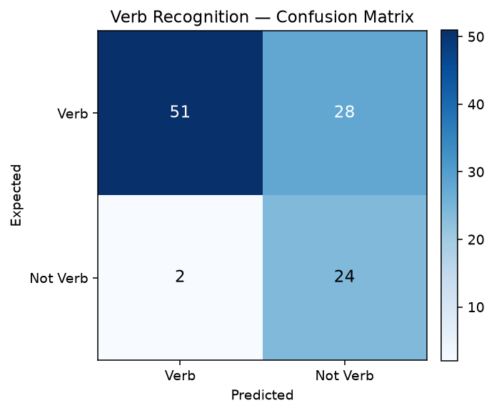
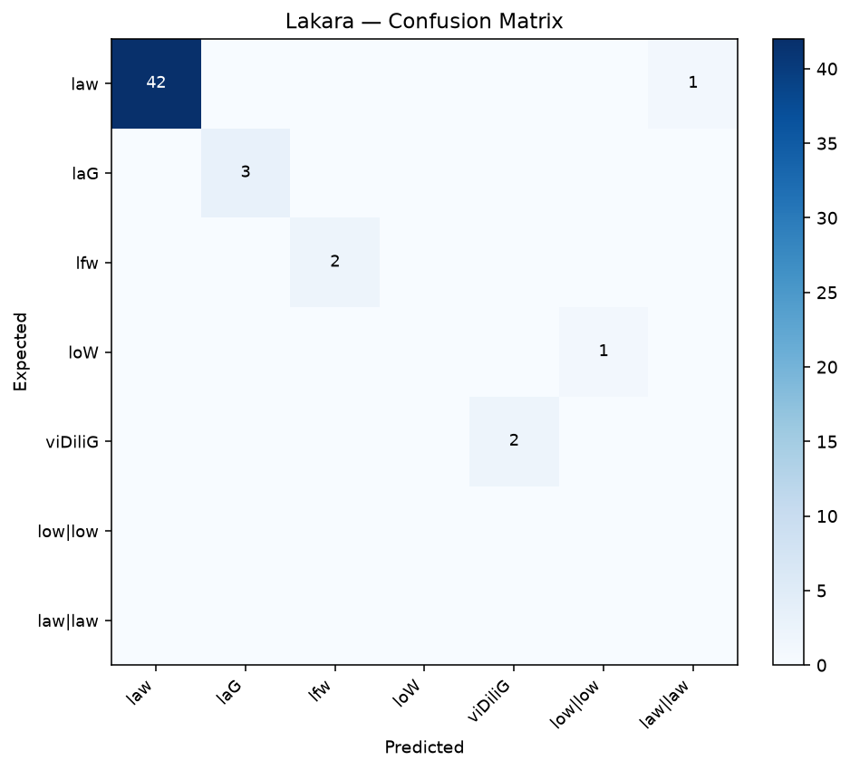
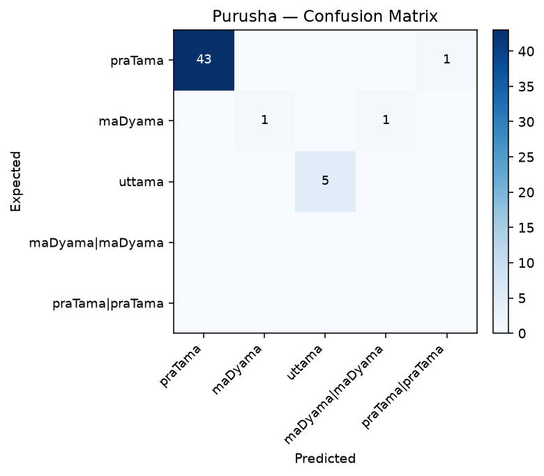
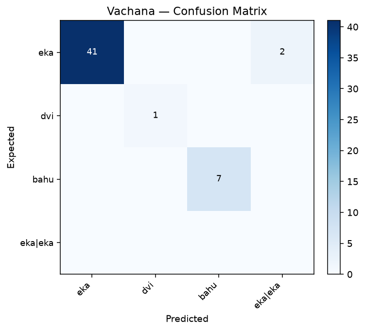

# Paninian Analyzer — Evaluation Report

## 1. Verb Recognition

- True Positives  : 51
- False Positives : 2
- False Negatives : 28
- True Negatives  : 24

- **Precision** : 0.962
- **Recall**    : 0.646
- **F1-Score**  : 0.773
- **Accuracy**  : 0.714

## 2. Morphological Field Accuracy

| Field   | Accuracy |
|---------|----------|
| Root    | 0.961 (49/51) |
| Lakara  | 0.961 |
| Purusha | 0.961 |
| Vachana | 0.961 |
| Gana    | 0.922 |

## 3. Confusion Matrices

### Lakara

### Purusha

### Vachana

## 4. Detailed Errors

| Form | Exp Root | Got Root | Exp Lakara | Got Lakara | Exp Purusha | Got Purusha |
|------|----------|----------|------------|------------|-------------|-------------|
| आगच्छति | gam |  | law | None | praTama | None |
| उपविशति | viz |  | law | None | praTama | None |
| पाठयति | paW |  | law | None | praTama | None |
| गच्छ | gam |  | loW | None | maDyama | None |
| आगच्छ | gam |  | loW | None | maDyama | None |
| उपविश | viz |  | loW | None | maDyama | None |
| तिष्ठ | sTA |  | loW | None | maDyama | None |
| वद | vad |  | loW | None | maDyama | None |
| शृणु | Sru |  | loW | None | maDyama | None |
| पिब | pA |  | loW | None | maDyama | None |
| कुरु | kf |  | loW | None | maDyama | None |
| पठ | paW |  | loW | None | maDyama | None |
| लिख | liK |  | loW | None | maDyama | None |
| पश्य | dfS |  | loW | None | maDyama | None |
| स्वप | svap |  | loW | None | maDyama | None |
| चर | car |  | loW | None | maDyama | None |
| धाव | DAv | [DAvu, sf] | loW | low|low | maDyama | maDyama|maDyama |
| अश | aS |  | loW | None | maDyama | None |
| ददातु | dA |  | loW | None | praTama | None |
| प्रार्थयति | prArT |  | law | None | praTama | None |
| क्रोध्यति | kruD |  | law | None | praTama | None |
| भव्यति | BU |  | law | None | praTama | None |
| तलति | tal |  | law | None | praTama | None |
| भस्मीभवति | BU |  | law | None | praTama | None |
| सुदाम्यति | dAm |  | law | None | praTama | None |
| अनुक्षिपति | kzip |  | law | None | praTama | None |
| मिशति | miz |  | law | None | praTama | None |
| कृणाति | kf | [kFY, kF] | law | law|law | praTama | praTama|praTama |
| छिनति | Cid |  | law | None | praTama | None |
| विभाजति | Baj |  | law | None | praTama | None |

